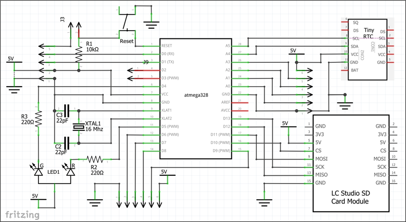
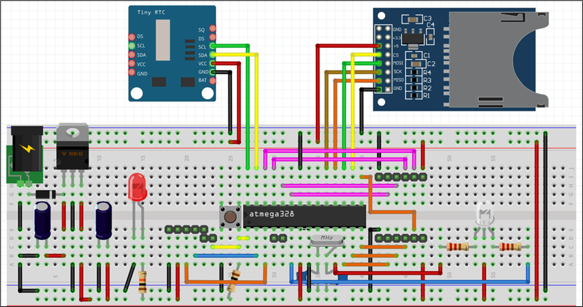
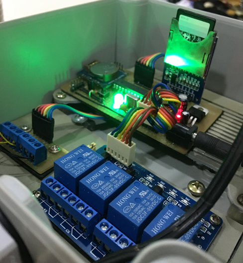
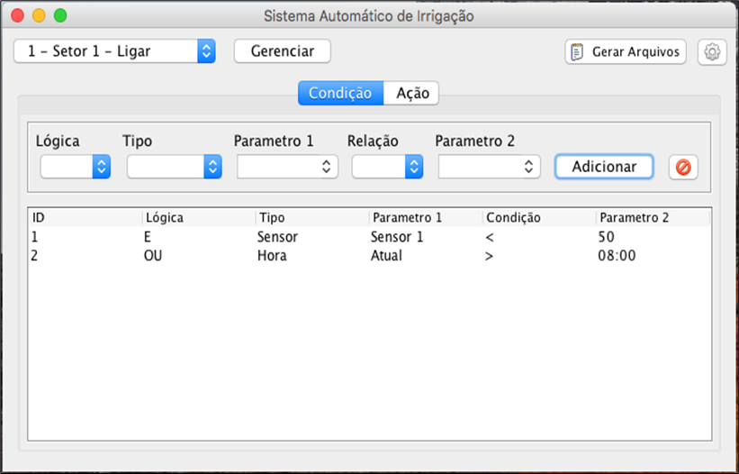

# Agritech
Código fonte do sistema de automação para irrigação

# Lista de Componentes
- **Atmega 328p DIP**
- **Leitor SD Card**
- **RTC DS1307 **
- **Componentes eletrônicos:**
   - Cristal 16Mhz
   - LM7805
   - 2 x Capacitor 22pF
   - 2 x Resitor 220Ω
   - 2 x LED
   - Resitor 10 KΩ
   - Switch

# Diagrama do Circuito

# Protótipo montado

# Software de comfiguração pelo Desktop

